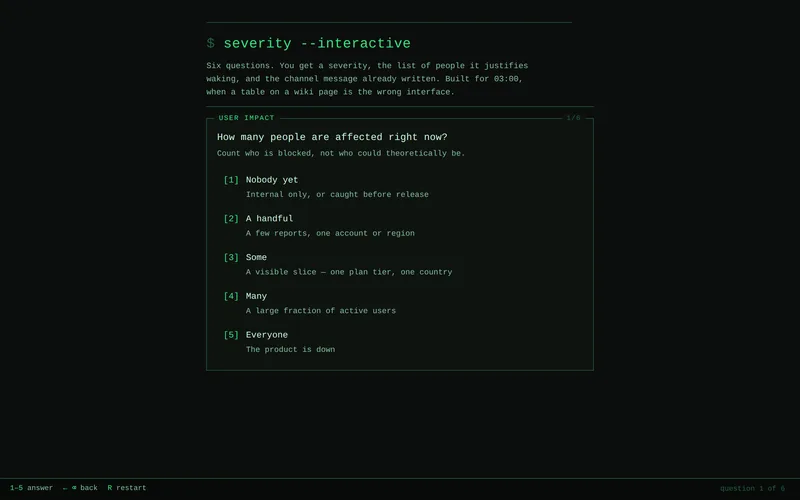
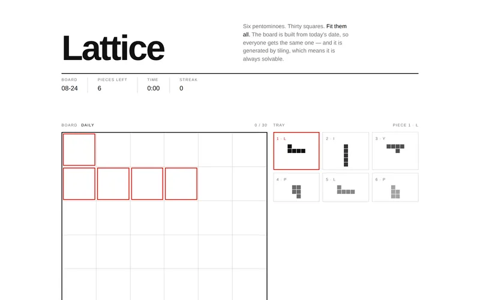
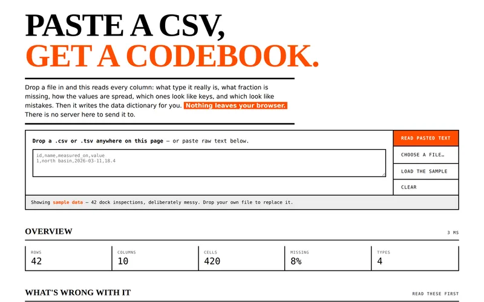
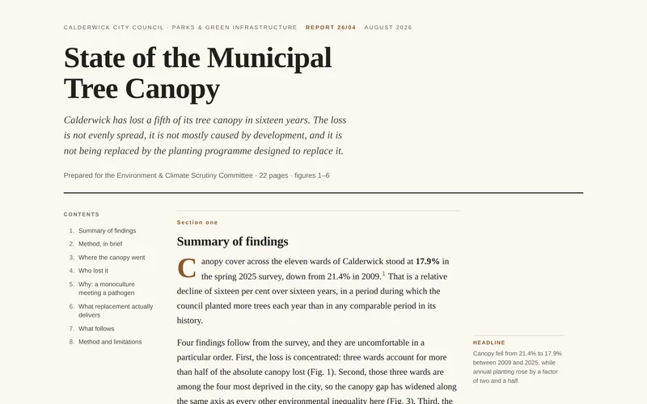
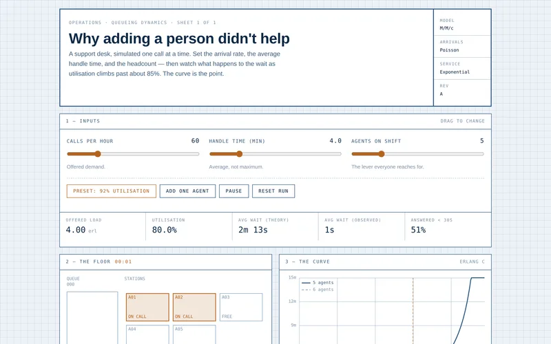

# awesome-claude-artifacts

**A gallery of remixable, single-file Claude artifacts.** Every entry ships its full
source, the prompt that made it, and notes on what to change to make it yours.

[](https://github.com/zoltlabs/awesome-claude-artifacts/actions/workflows/validate.yml)
[](LICENSE)

🌐 **[awesomeclaudeartifacts.com](https://awesomeclaudeartifacts.com)** · 📐 [Taxonomy spec](docs/taxonomy.html) · 🤝 [Contributing](CONTRIBUTING.md)

> [!NOTE]
> An independent community project. Not affiliated with or endorsed by Anthropic.
> Claude is a trademark of Anthropic PBC.

---

## What this is

Most collections of AI-generated work are a wall of links that rot within a year.
This one holds the actual files. That buys three things:

- **Thumbnails that always work** — CI renders every entry, so nothing depends on a
  third-party page still being up.
- **Remixing** — copy the source, copy the prompt, change three things, ship it.
- **A searchable corpus** — filter by what you're doing *and* by the shape you need.

Every entry is **one self-contained `.html` file**. No CDN scripts, no network calls,
no build step. If it doesn't run from a `file://` URL with the wifi off, it doesn't
belong here.

## How entries are classified

Two independent axes. The full definitions live in the
**[taxonomy spec](docs/taxonomy.html)**; the machine-readable vocabularies live in
[`taxonomy.yaml`](taxonomy.yaml).

**Use case** — the job, and who's doing it. How people arrive.

`teaching` · `marketing` · `sales` · `consulting` · `product-design` ·
`data-research` · `internal-ops` · `personal` · `creative` · `play`

**Style** — the interaction shape, independent of subject. How people find something
to steal. Grouped into five families:

| Family | Styles | Shape |
| --- | --- | --- |
| **Present** | `deck` · `one-pager` · `report` | You read it, front to back |
| **Explain** | `diagram` · `timeline` · `simulator` | You poke it to understand something |
| **Calculate** | `calculator` · `comparator` · `wizard` | Inputs go in, an answer comes out |
| **Explore** | `dashboard` · `data-explorer` | Data in, many views out |
| **Engage** | `quiz` · `game` · `generator` · `tracker` | A loop, a score, or state that persists |

Style is the primary axis, because it's the one that transfers. A trip-budget
calculator and a SaaS ROI calculator are the same artifact with different labels —
and the best example of the shape you need is usually from a domain you've never
worked in.

## The catalogue

> [!IMPORTANT]
> **Pre-launch — 5 of a targeted 76.** The seed set is being filled deliberately across
> the coverage matrix so no filter comes back empty on day one. The candidate slate for
> the rest is in [docs/seed-candidates.md](docs/seed-candidates.md), the visual
> treatments in [docs/design-treatments.md](docs/design-treatments.md), and the plan in
> [§4 of the spec](docs/taxonomy.html).
> Thumbnails appear once the render bot has run on each entry.

<!-- CATALOGUE:START — generated by scripts/build-index.mjs, do not edit by hand -->
| | Artifact | Style | Use case |
| --- | --- | --- | --- |
|  | **[Incident Severity Wizard](artifacts/incident-severity-wizard/)**<br>Six questions that resolve to a severity level, the people it justifies paging, and a channel message already written. | `wizard` | `internal-ops` |
|  | **[Lattice](artifacts/lattice/)**<br>A daily pentomino packing puzzle whose board is generated from the date, so everyone gets the same one without a server. | `game` | `play` |
|  | **[Paste a CSV, Get a Codebook](artifacts/csv-codebook/)**<br>Profiles a delimited file in the browser — types, missingness, distributions, outliers — and writes the data dictionary for you. | `data-explorer` | `data-research` |
|  | **[State of the Municipal Tree Canopy](artifacts/municipal-tree-canopy/)**<br>A long-form findings report on canopy loss across a fictional city's wards, with six figures, footnotes and a methods appendix that states its own limits. | `report` | `data-research` `consulting` |
|  | **[Why Adding a Person Didn't Help](artifacts/queue-staffing-simulator/)**<br>Simulates a support desk so you can watch wait times go vertical as utilisation approaches capacity. | `simulator` | `consulting` `internal-ops` |
<!-- CATALOGUE:END -->

## Contributing

Submissions are welcome and reviewed by a human. The short version:

1. One self-contained `.html` file, under 2 MB, no network calls.
2. A `meta.yaml` with `use_case`, exactly one `style`, an author, and a license.
3. Ideally the prompt that made it — for most of this audience, the prompt *is* the
   deliverable.

Full rules and the local workflow are in **[CONTRIBUTING.md](CONTRIBUTING.md)**.
The curation bar and CI gates are in the spec, so a declined PR always has something
concrete to point at.

## Repo layout

```
artifacts/<slug>/     source entries — artifact.html + meta.yaml + thumb.webp
linked/<slug>/        link-only entries — meta.yaml + a normalised screenshot
taxonomy.yaml         closed vocabularies; changing it is its own PR
schema/               JSON Schema for meta.yaml
scripts/              validate · shoot (screenshots) · build-index
docs/taxonomy.html    the specification
site/                 the static gallery
```

## Licensing

The tooling in this repo is MIT. **Each entry carries its own license**, declared in
its `meta.yaml`, and contributors may only submit work they made themselves.

Found something here that infringes your rights? Open an issue titled `DMCA` or email
the address in [CONTRIBUTING.md](CONTRIBUTING.md) and it will be removed while we sort
it out.
